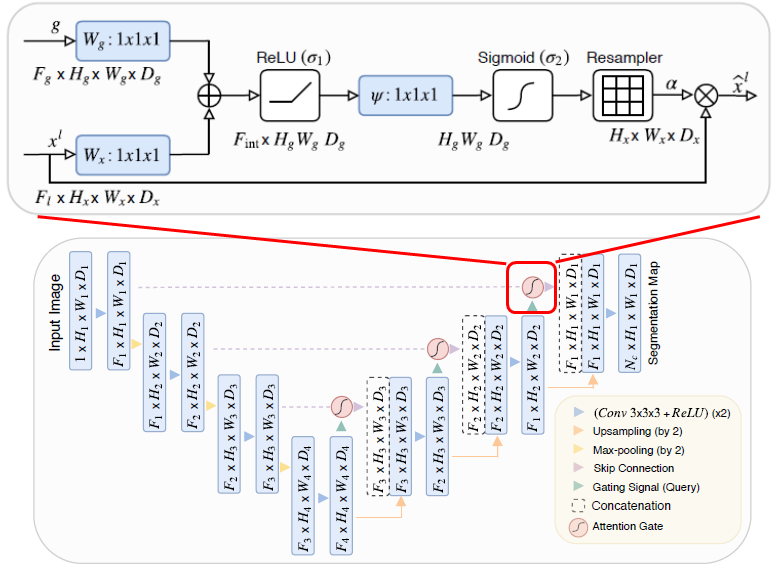

# Project Presentation: Arctic Sea Ice Challenge by ESA

## Magnus Ostertag, Antonius Scherer
## AI in Industry, Prof. Michele Lombardi
## Winter Term 2022/2023

---

## Content

1. challenge overview (Magnus)
2. understanding the data (Magnus)
3. Our Code (Toni)
4. u-net model improvements (Magnus)
5. results (Magnus)
6. u-net model attention (Toni)
7. results (Toni)
8. summary (Toni)
9. lessons learned (and possible improvements) (Toni)

---

## Challenge Overview

see `introduction.ipynb`

* goal: automatically produce sea ice charts
* Sea Ice Concentration (SIC), the Stage Of Development (SOD), and the floe size (FLOE) to be predicted
* 493 training and 20 test (without label data) data files

Sea ice parameter | Metric | Weight in total score
---|---|---
Sea ice concentration | R2 | 2/5
Stage of development | F1 | 2/5
Floe size | F1 | 1/5

---

### Geographic Coverage

see the data manual.

---

## Challenge Overview continued

* main data: Sentinel-1 active microwave (SAR) data and corresponding Microwave Radiometer (MWR) data from the AMSR2 satellite sensor
  * SAR data has ambiguities, it has a high spatial resolution
  * MWR data has good contrast between open water and ice
* auxiliary data: numerical weather prediction model data, incidence angle of the SAR sensor and distance from land
* data loader, upload script and basic u-net given
* computational resources: 200h of CPU time, 40h of GPU time with `mlflow`

---

### Exemplary Scene

Data of the sea ice concentration, see the data manual.

---

## Understanding the Data

goto `distributions.ipynb`

* train vs. test vs. validation distribution for the different classes
* pixel counting the coverage of the scenes
* (inter-analyst accuracy)

---

## Our Code

A tour through the repository.

---

## U-Net

---

## U-Net Model Improvements

`*_improvements.py` (and earlier `*_transfer.py`)

* regression loss when using a regression metric `unet*.py`, `quickstart*.ipynb`
* transfer learning `unet_transfer.py`
* biased sampling of the training data: `loaders_improvements.py` -> goto `misc/`
* diagnostics output `quickstart_improvements.ipynb`, `loaders_improvements.ipynb`

---

## Statistics of the Runs

Performance | total score | SIC | SOD | FLOE | comment
---|---|---|---|---|---
`Pizza Marinara` | 74.5 | 75.2 | 76.4 | 69.4 | 4-lvl u-net
`Pizza Margherita` | 71.5 | 70.4 | 74.3 | 68.13 | 8-lvl u-net
`Pizza Basilico` | 75.6 | 78.2 | 75.3 | 70.0 | more epochs
`Pizza Quattro Formaggi` | 68.1 | 68.8 | 69.9 | 62.8 | 8-lvl, all improvements
`Pizza Quattro Stagioni` | 77.7 | 83.82 | 77.50 | 66.13 | 6-lvl, all improvements

* long training might be necessary, but the best model was always already around epoch `40`
* slower model build-up for transfer learning

---
## U-Net Model Attention

`*_attention.py`

* we used the attention mechanism from the paper [Attention U-Net: Learning Where to Look for the Pancreas](https://arxiv.org/abs/1804.03999)
* it adds attention to the u-net model and is therefore able to focus on the most important parts of the image:

* due to the increased memory usage, we needed to reduce the size of the validation images
* 
---

## Statistics of the Runs

Performance | total score | SIC | SOD | FLOE | comment
---|---|---|---|---|---
`Pizza Neapolitana` | 74.5 | 75.2 | 76.4 | 69.4 | 4-lvl u-net
`Pizza Margherita` | 71.5 | 70.4 | 74.3 | 68.13 | 8-lvl u-net
`Pizza Basilico` | 75.6 | 78.2 | 75.3 | 70.0 | more epochs
`Pizza Quattro Formaggi` | 68.1 | 68.8 | 69.9 | 62.8 | 8-lvl, all improvements
`Pizza Quattro Stagioni` | 77.7 | 83.82 | 77.50 | 66.13 | 6-lvl, all improvements

* long training might be necessary, but the best model was always already around epoch `40`
* slower model build-up for transfer learning

---
## Error Distributions

goto `visualize_metadata.ipynb`

* there are strong differences across locations, but this is partly due to the resampling
* some months are clearly easier to predict than others, but no clear seasonality can be seen
* the weather service has a slight, but consistent effect

---

## Summary

* u-net is a good model for the task
* a larger size of the convolution filters is not that important for the performance
* attention performs very well even for small number of epochs (?)
* the scores were not as high as we expected, but the problem was made harder and the computational resources were lacking

---

## Lessons Learned

* RAM problems with the very large image data and python
* use the home GPU
* adding code to a complex code base
* using remote computing and `mlflow`

### and possible improvements

* featurize additional information like location and month
* build incremental transfer learning models, train even longer
* play with the learning rate
